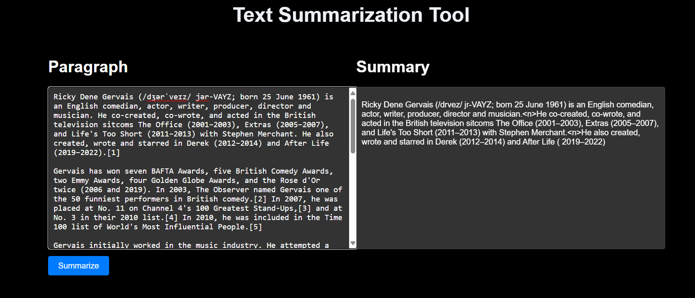

# text-summarization using Hugginng face

# TEXT-SUMMARIZATION TOOL

The text-summarization tool uses the Google pegasus model to summarize texts. It is a SeqtoSeq model that takes in the input text and ouputs the summary of the text.
The model is finetuned on certain data and the predictions are made from the fine-tuned model. 

    
    
<em>Text Summarizer.</em>

### Define the workflows

1. config.yaml
2. Params.yaml
3. Config.entity
4. Configuration manager
5. Update the components - Data Ingestion,Data Transformation, Model Trainer
6. Create our Pipeline - Training Pipeline,prediction Pipeline
7. Front end apis', Training APi's, Batch Predcition api's

